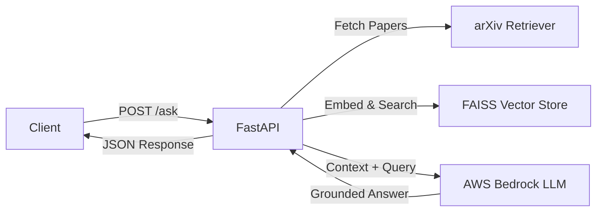

# Modular RAG Research Backend

**Role:** Backend Architect | **Stack:** FastAPI, FAISS, AWS Bedrock
**Source Code:** [View on GitHub](https://github.com/ipritamdash/rag-research-backend)

---

A backend-only service designed to solve LLM hallucinations. It retrieves real-time context from scientific literature (arXiv) to ground LLM responses, exposed via high-performance REST APIs.

### System Architecture



### Key Engineering Decisions

**1. FAISS over Managed Vector Databases**

- **Context:** Queries operate on small batches or per-request paper sets.
- **Decision:** Used in-memory FAISS to avoid external infrastructure dependencies.
- **Trade-off:** Requires serialization for persistence, but avoids latency and cost of managed services.

**2. Asynchronous I/O**

- **Context:** arXiv retrieval and LLM inference are I/O-bound.
- **Decision:** Implemented `async` / `await` across FastAPI routes.
- **Result:** Prevents request blocking and improves concurrency.

### API Interface

**Request:**

```json
{
  "question": "Is reinforcement learning better than supervised learning?",
  "max_results": 3
}
```

**Response:**

```json
{
  "answer": "Reinforcement learning (RL) can outperform other machine learning approaches in specific domains such as sequential decision-making and automated pipeline synthesis. Research shows that incorporating motivational or emotion-driven signals can improve learning efficiency, while model-based RL has demonstrated state-of-the-art performance and significant speedups in AutoML tasks. These advantages are domain-dependent, and RL is not a universal replacement for supervised or unsupervised learning.",
  "sources": [
    {
      "title": "Emotion in Reinforcement Learning Agents and Robots: A Survey",
      "url": "[http://arxiv.org/abs/1705.05172v1](http://arxiv.org/abs/1705.05172v1)"
    },
    {
      "title": "Automatic Machine Learning by Pipeline Synthesis using Model-Based Reinforcement Learning and a Grammar",
      "url": "[http://arxiv.org/abs/1905.10345v1](http://arxiv.org/abs/1905.10345v1)"
    }
  ]
}
```
